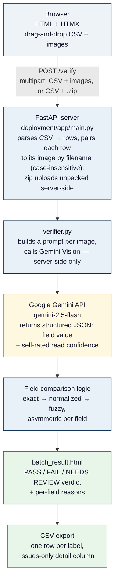

# TTB Label Verifier

An AI-assisted prototype that helps TTB compliance agents verify alcohol beverage label images against COLA application data — built for the Treasury take-home assignment.

**Live demo:** [huggingface.co/spaces/OttoDC/TTB-Label-Verifier](https://huggingface.co/spaces/OttoDC/TTB-Label-Verifier)
**Quick start:** `./run.sh` or `make` — see [deployment/README.md](deployment/README.md) for full setup details.

---

## Background

The full project brief — stakeholder interview notes, technical requirements, and evaluation criteria — lives in [`docs/TreasuryInstructions.md`](docs/TreasuryInstructions.md). The short version: TTB reviews roughly 150,000 label applications a year with a team of 47 agents, and most of that review time is spent on routine matching — confirming that the brand name, ABV, and Government Warning printed on a label match what was submitted in the application. This prototype automates that first-pass comparison so agents can focus their attention on flagged discrepancies instead of re-reading every field on every label by eye.

Three constraints from the interviews shaped the design directly: results need to come back in seconds, not the 30-40 seconds that sank a prior scanning-vendor pilot; the tool needs to be usable by agents with a wide range of technical comfort, including agents who print their emails; and large importers occasionally submit 200-300 labels at once, which today gets processed one at a time.

## What it does

An agent provides a CSV with the application data already in it (brand name, class/type, ABV, net contents, whether a Government Warning is required) alongside the matching label image(s) — either a few files selected directly, or a single .zip for large batches. There's no manual form-filling: the CSV is the input, mirroring how this data already exists digitally in a real COLA submission.

Each label image is sent to Google Gemini Vision, which reads what's actually printed on the label as structured text. Every field is then compared against the submitted application data using exact, normalized, and fuzzy matching, and the agent receives a clear verdict per label: **PASS**, **FAIL**, or **NEEDS REVIEW**, with a plain-language reason for every field that didn't cleanly confirm. Results can be exported as a CSV — one row per label — for recordkeeping.

A single-label check is simply a one-row CSV under the hood — there's no separate "batch mode" to learn; the same form and the same logic handle one label or three hundred.

## Architecture



The single outbound network dependency is the FastAPI server calling Gemini's API — the browser never talks to Gemini directly, and the key lives only in a server-side environment variable / HF Secret.

## Assumptions made

The brief explicitly states that part of the evaluation is completing the assignment from the written instructions, with clarifying questions available but not required. Two clarifying questions were sent (on the application-data input model, and on output granularity); everything else below was a deliberate assumption, made to keep the build scoped to what could be finished well in the time available rather than ambitiously incomplete.

1. **Label images are JPEG or PNG only.** PDF label submissions (sometimes used in real COLA filings) are out of scope for this prototype.
2. **Application data arrives as a CSV, not a live COLA integration.** Marcus's interview notes were explicit that COLA integration is its own project with its own authorization requirements and years away from this prototype. A CSV is the most realistic stand-in for "data that already exists digitally" without building a mock database.
3. **Government Warning validation uses the exact statutory wording** (27 CFR 16.21). Per Jenny's notes, this check is treated as strict and near-exact — minor case/punctuation drift is downgraded to a review flag rather than an automatic pass, since real-world label evasion (title case, reworded text, tiny fonts) is exactly what this field needs to catch.
4. **Brand name and class/type matching is deliberately lenient.** Dave's "STONE'S THROW" vs "Stone's Throw" example is treated as the same value — fuzzy/normalized matching is applied so a compliant label isn't rejected over capitalization.
5. **Confidence is per-field, not a single headline percentage.** The verdict (PASS/FAIL/NEEDS REVIEW) is the headline; per-field confidence percentages only appear in the detail view, where they explain *why* a specific field didn't cleanly confirm.
6. **No authentication, no persistent storage.** This is an open prototype for evaluation, not a production deployment behind TTB's identity system. Nothing is written to disk or a database between requests.

## Constraints, design decisions, and trade-offs

Four decisions shaped this build more than any others. Each ties back to specific stakeholder feedback from the interview notes.

### 🔌 One outbound dependency, not zero

Marcus's notes describe a prior vendor pilot where the firewall blocked outbound calls to ML endpoints, breaking half the tool's features.

**The fix:** only the FastAPI server calls Gemini — never the browser. One predictable domain (`generativelanguage.googleapis.com`) to allowlist, not an open set of client-side ML calls.

**The trade-off:** this is not a fully air-gapped solution. A local OCR pipeline (e.g. Tesseract) would remove the dependency entirely, but handles real-world label photos — angles, glare, stylized fonts — noticeably worse. Since the brief's stretch goal explicitly asks for tolerance of imperfect photos, accuracy won the trade.

### ⚖️ Asymmetric matching, on purpose

Dave needs brand names to forgive case/punctuation differences (`STONE'S THROW` vs `Stone's Throw`). Jenny needs the Government Warning to forgive nothing — people actively try to evade it with title case, reworded text, or tiny fonts.

**The fix:** lenient, normalized matching for brand/class fields; strict, near-exact matching for the warning. One fuzzy-match-everything rule would fail one of these two requirements no matter how it's tuned — so the strictness is asymmetric by design, not an oversight.

### 🖥️ No frontend framework

The brief leaves the stack open, and the UX bar is explicit: *"something my mother could figure out."*

**The fix:** Jinja2 server-rendered templates + HTMX. No Node build step, no separate frontend deploy, no second language. One Python service end to end — simpler to run locally and simpler to deploy to Hugging Face Spaces.

### 📊 Confidence explains, it doesn't summarize

A single blended "overall confidence" number averages across fields — which means one outright mismatch can get masked by several unrelated matches into a falsely reassuring score.

**The fix:** the verdict (PASS / FAIL / NEEDS REVIEW) is the headline. Confidence percentages live only at the field level, where they answer a real question — *why* didn't this field confirm — instead of pretending to summarize the whole label in one misleading number.

## Project structure

```
TakeHomeProject/
├── run.sh                      # one-command setup + launch
├── Makefile                    # make / make run / make setup / make clean
├── README.md                   # this file
├── deployment/                 # the application itself (see deployment/README.md)
│   ├── app/
│   │   ├── main.py             # FastAPI routes: /, /verify, /export, /template.csv, /health
│   │   ├── verifier.py         # Gemini Vision calls, CSV parsing, batch orchestration, matching logic
│   │   ├── models.py           # Pydantic schemas (ApplicationData, FieldResult, BatchSummary, etc.)
│   │   └── templates/
│   │       ├── base.html          # shared layout, header, CSS, HTMX script tag
│   │       ├── index.html         # unified upload form: CSV + images (multi-select
│   │       │                      #   w/ removable file list) or CSV + .zip for large batches
│   │       └── batch_result.html  # single-label card or batch table from the same data,
│   │                              #   plus the CSV export form
│   ├── Dockerfile
│   ├── requirements.txt
│   ├── .env.sample
│   └── README.md
├── scripts/
│   └── generate_test_labels.py # synthetic label generator with known ground truth
├── docs/
│   └── TreasuryInstructions.md # the original take-home brief
└── .github/workflows/          # auto-deploy to Hugging Face Spaces on push
```

## Limitations and roadmap

| Limitation | Why it exists | What lifts it |
|---|---|---|
| **Heavily distorted photos** can still come back UNREADABLE | Gemini Vision tolerates angles, glare, and poor lighting far better than traditional OCR, but extreme cases still defeat it | A re-shoot — the same fallback an agent uses today |
| **Field coverage is the common case** — brand, class/type, ABV, net contents, Government Warning | Matches the fields described in the brief | Extend the prompt + comparison logic for bottler/producer address, country of origin, sulfite declarations |
| **Not COLA-integrated** — no auth, no audit log, no live system connection | Explicitly a standalone proof-of-concept per Marcus's notes; COLA integration is its own project | Out of scope by design, not a gap — the natural next step for a production path |
| **Batch throughput capped** at Gemini's free-tier rate limit (15 req/min) — a 300-image batch takes several minutes | Free tier keeps the prototype at zero cost | A paid API tier removes the ceiling entirely |
| **No automated test suite** | `scripts/generate_test_labels.py` generates labels with known ground truth for manual testing, but nothing runs them automatically yet | A `pytest` suite + CI gate over the matching logic — the natural next addition |
