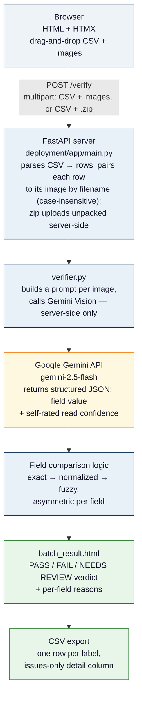

# TTB Label Verifier

An AI-assisted prototype that helps TTB compliance agents verify alcohol beverage label images against COLA application data — built for the Treasury take-home assignment.

**Live demo:** [huggingface.co/spaces/OttoDC/TTB-Label-Verifier](https://huggingface.co/spaces/OttoDC/TTB-Label-Verifier)
**Quick start:** `./run.sh` or `make` — see [deployment/README.md](deployment/README.md) for full setup details.

---

## Background

The full project brief — stakeholder interview notes, technical requirements, and evaluation criteria — lives in [`docs/TreasuryInstructions.md`](docs/TreasuryInstructions.md). The short version: TTB reviews roughly 150,000 label applications a year with a team of 47 agents, and most of that review time is spent on routine matching — confirming that the brand name, ABV, and Government Warning printed on a label match what was submitted in the application. This prototype automates that first-pass comparison so agents can focus their attention on flagged discrepancies instead of re-reading every field on every label by eye.

Three constraints from the interviews shaped the design directly: results need to come back in seconds, not the 30-40 seconds that sank a prior scanning-vendor pilot; the tool needs to be usable by agents with a wide range of technical comfort, including agents who print their emails; and large importers occasionally submit 200-300 labels at once, which today gets processed one at a time.

## What it does

An agent provides a CSV with the application data already in it (brand name, class/type, ABV, net contents, whether a Government Warning is required) alongside the matching label image(s) — either a few files selected directly, or a single .zip for large batches. There's no manual form-filling: the CSV is the input, mirroring how this data already exists digitally in a real COLA submission.

Each label image is sent to Google Gemini Vision, which reads what's actually printed on the label as structured text. Every field is then compared against the submitted application data using exact, normalized, and fuzzy matching, and the agent receives a clear verdict per label: **PASS**, **FAIL**, or **NEEDS REVIEW**, with a plain-language reason for every field that didn't cleanly confirm. Results can be exported as a CSV — one row per label — for recordkeeping.

A single-label check is simply a one-row CSV under the hood — there's no separate "batch mode" to learn; the same form and the same logic handle one label or three hundred.

## Architecture



The single outbound network dependency is the FastAPI server calling Gemini's API — the browser never talks to Gemini directly, and the key lives only in a server-side environment variable / HF Secret.

## Assumptions made

The brief explicitly states that part of the evaluation is completing the assignment from the written instructions, with clarifying questions available but not required. Two clarifying questions were sent (on the application-data input model, and on output granularity); everything else below was a deliberate assumption, made to keep the build scoped to what could be finished well in the time available rather than ambitiously incomplete.

1. **Label images are JPEG or PNG only.** PDF label submissions (sometimes used in real COLA filings) are out of scope for this prototype.
2. **Application data arrives as a CSV, not a live COLA integration.** Marcus's interview notes were explicit that COLA integration is its own project with its own authorization requirements and years away from this prototype. A CSV is the most realistic stand-in for "data that already exists digitally" without building a mock database.
3. **Government Warning validation uses the exact statutory wording** (27 CFR 16.21). Per Jenny's notes, this check is treated as strict and near-exact — minor case/punctuation drift is downgraded to a review flag rather than an automatic pass, since real-world label evasion (title case, reworded text, tiny fonts) is exactly what this field needs to catch.
4. **Brand name and class/type matching is deliberately lenient.** Dave's "STONE'S THROW" vs "Stone's Throw" example is treated as the same value — fuzzy/normalized matching is applied so a compliant label isn't rejected over capitalization.
5. **Confidence is per-field, not a single headline percentage.** An early version of this tool displayed an averaged "80% confidence" banner that diluted an outright brand-name mismatch into a number that looked reassuring. The verdict (PASS/FAIL/NEEDS REVIEW) is now the headline; per-field percentages only appear where they're diagnostic, not as a misleading summary statistic.
6. **No authentication, no persistent storage.** This is an open prototype for evaluation, not a production deployment behind TTB's identity system. Nothing is written to disk or a database between requests.

## Constraints, design decisions, and trade-offs

**Outbound network access is a single, predictable path — not eliminated entirely.** Marcus's interview notes describe a prior scanning-vendor pilot where outbound calls to ML endpoints were blocked by TTB's firewall, breaking the tool. The architectural response here is that the *browser* never makes an outbound AI call — only the FastAPI server does, to one domain (`generativelanguage.googleapis.com`). That's a meaningfully smaller and more predictable surface for a network team to allowlist than a tool making client-side calls to arbitrary ML endpoints, but it is a real outbound dependency, not a fully air-gapped one. A fully local OCR pipeline (e.g., Tesseract running on-box) would eliminate the dependency entirely at the cost of materially worse accuracy on real-world label photos — angled shots, glare, stylized fonts — which Tesseract handles poorly without heavy preprocessing. Given that the stated stretch goal explicitly asks for tolerance of imperfect photos, the trade was made deliberately in favor of a vision model over a fully local pipeline, accepting one well-defined outbound dependency in exchange for meaningfully better real-world accuracy.

**Asymmetric matching strategy, by design.** The comparison logic does not apply the same tolerance to every field, because the two ends of the spectrum have opposite failure modes. Brand name and class/type use lenient, normalized matching — directly per Dave's feedback that case and punctuation differences shouldn't fail an otherwise-correct label. The Government Warning uses strict, near-exact matching — directly per Jenny's feedback that this is the field people try to evade, and a "smart" fuzzy match here would risk waving through a title-cased or reworded warning that should be rejected. A single fuzzy-match-everything approach would either reject valid brands or accept doctored warnings; treating fields asymmetrically is the only approach that serves both real failure modes correctly.

**No separate frontend framework.** The brief leaves technology choice open, and the UI requirement — "something my mother could figure out" — argues for simplicity over sophistication. Jinja2 server-rendered templates plus HTMX cover every interaction this tool needs (file upload, drag-and-drop, a results table) without a Node build step, a separate frontend deployment, or a second language in the stack. This also means the entire application is one Python service, which simplifies both local setup and the Hugging Face Spaces deployment.

**Confidence percentages are diagnostic, not a verdict.** Gemini self-rates how clearly it read each field (0-100), and that's blended with a rule-based match score — but a clean field-value mismatch is always reported as 0% confidence regardless of how crisply the (wrong) text was photographed, because the percentage answers "how confident are we this field is correct," not "how clear was the photo." This was a direct fix after testing surfaced a case where an obvious, certain brand-name mismatch was diluted by other matching fields into a misleadingly reassuring 80%.

## Project structure

```
TakeHomeProject/
├── run.sh                      # one-command setup + launch
├── Makefile                    # make / make run / make setup / make clean
├── README.md                   # this file
├── deployment/                 # the application itself (see deployment/README.md)
│   ├── app/
│   │   ├── main.py             # FastAPI routes: /, /verify, /export, /template.csv, /health
│   │   ├── verifier.py         # Gemini Vision calls, CSV parsing, batch orchestration, matching logic
│   │   ├── models.py           # Pydantic schemas (ApplicationData, FieldResult, BatchSummary, etc.)
│   │   └── templates/
│   │       ├── base.html          # shared layout, header, CSS, HTMX script tag
│   │       ├── index.html         # unified upload form: CSV + images (multi-select
│   │       │                      #   w/ removable file list) or CSV + .zip for large batches
│   │       └── batch_result.html  # single-label card or batch table from the same data,
│   │                              #   plus the CSV export form
│   ├── Dockerfile
│   ├── requirements.txt
│   ├── .env.sample
│   └── README.md
├── scripts/
│   └── generate_test_labels.py # synthetic label generator with known ground truth
├── docs/
│   └── TreasuryInstructions.md # the original take-home brief
└── .github/workflows/          # auto-deploy to Hugging Face Spaces on push
```

## Limitations and roadmap

**Imperfect photos.** Gemini Vision is materially more tolerant of angled or poorly-lit photos than a traditional OCR pipeline would be, but heavy distortion, severe glare, or extreme blur can still produce an UNREADABLE result requiring a re-shoot — the same outcome an agent would reach today.

**Field coverage.** The current field set (brand name, class/type, ABV, net contents, Government Warning) covers the common case described in the brief. Less common label elements — bottler/producer name and address, country of origin for imports, sulfite declarations — are not yet extracted or compared.

**Not COLA-integrated.** This is explicitly a standalone proof-of-concept per Marcus's notes, with no authentication, no audit log, and no connection to the live COLA system. Those are the obvious next steps for a production path, not gaps in this prototype's scope.

**Batch throughput is bounded by Gemini's free-tier rate limit** (15 requests/minute), so a full 300-image batch takes several minutes rather than completing instantly. A production deployment with a paid API tier would remove this ceiling.

**No automated test suite yet.** A synthetic label generator (`scripts/generate_test_labels.py`) produces labels with known ground truth for manual testing, but there is currently no `pytest` suite or CI gate exercising the matching logic automatically — a natural next addition.
